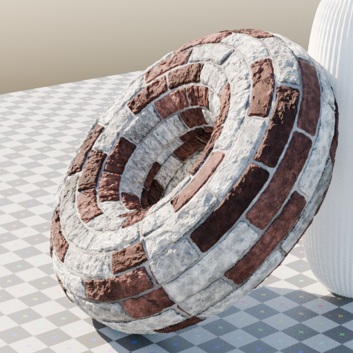
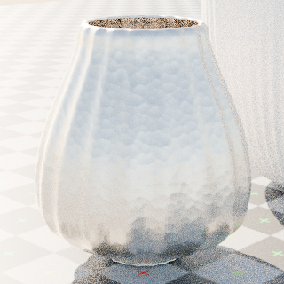
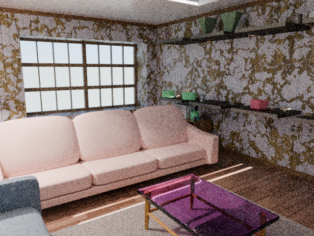

# 🎲 Infinigen 造物间 · Infinigen Web Studio

**给非技术用户的 Infinigen 网页版**：点一下卡片，生成一个世界上从未存在过的 3D 材质、家具或房间。
A zero-dependency local web UI that wraps [Infinigen 2.0](https://github.com/princeton-vl/infinigen) — pick a card, click generate, get a photorealistic procedural render.

| 🧱 材质 Materials | 🛋️ 家具 Objects | 🏠 房间 Rooms |
|---|---|---|
|  |  |  |
| 18 种材质 × 5 种底模 | 18 种家具物件 | 程序化客厅 |

每个结果都由纯数学规则从零生成——换一个"编号"（随机种子）就是一个全新的、可复现的结果。

## ✨ 功能

- **三类生成**：材质（砖墙/大理石/木纹/金属/水磨石…，可贴在球体/猴头/香蕉等底模上）、家具物件（沙发/台灯/书柜/花瓶…）、完整客厅场景
- **三档画质**：快速预览（约半分钟）/ 标准 / 高清，自动映射分辨率与采样数
- **编号（seed）系统**：相同编号 = 完全相同的结果，🎲 一键换新
- **实时进度**：显示当前阶段与渲染采样进度
- **作品图库**：所有历史生成自动归档，随时回看
- **命令行透视**：每个结果附带等价 CLI 命令，是学习 Infinigen 的活教材

## 🚀 快速开始

需要 [uv](https://docs.astral.sh/uv/)（会自动安装 Python 3.11 和全部依赖，包含约 300MB 的 Blender 引擎 `bpy`）：

```bash
git clone https://github.com/Seanwilliam2077/infinigen-webui.git
cd infinigen-webui
uv sync
uv run python server.py
```

打开 **http://127.0.0.1:8765** 即可。端口被占用时：`PORT=8888 uv run python server.py`。

> 有 NVIDIA 显卡时 Cycles 自动走 GPU（OptiX），快速预览档一张图十几秒；纯 CPU 也能跑，只是更慢。

## 🧠 原理

本项目是 [Infinigen 2.0](https://infinigen.org)（PyPI 包 `infinigen==2.0.0a1`）命令行的薄封装：

```
浏览器 → 本地服务器(纯 Python 标准库) → uv run infinigen <生成器链> → Blender 无头渲染 → PNG
```

- 生成器名在服务端白名单校验，前端输入不进入命令行
- 单任务锁独占 GPU；输出使用绝对路径（规避 Windows 下 Blender 相对路径解析问题）
- 仅监听 127.0.0.1，本机使用

## 📖 深入了解：房间是怎么生成的

想知道这些场景背后到底发生了什么？[**《房间是怎么生成的》**](docs/room-generation-pipeline.md) 拆解了从一句命令到一个可物理交互房间的完整链路：

- **三个串联的模拟退火求解器**——分别工作在房间拓扑图、2D 平面多边形、3D 物体位姿上
- **约束 DSL**：为什么 `and` 要写成 `*`，硬约束和软代价如何分离成字典序目标
- **七个贪心阶段**为什么必须按物理依赖排序（小物件要等柜子变成真实网格）
- **占位符机制**：求解时用低模代理，最后才换成真资产
- **材质烘焙**：程序化 shader 如何塌缩成 452 张 PBR 贴图
- **`solve_state.json` 作为语义桥梁**：约束关系怎么变成 PhysX 的静态碰撞体 / 刚体
- Windows + Isaac Sim 6.0.1 上的 5 个兼容性坑与修法

文中所有数字均来自一次真实运行（33m46s 生成 / 988MB USD / 41,400 物理步），代码位置标注到行号。

## 🗺️ Roadmap

- [ ] 深度 / 法线等 Ground Truth 标注的可视化输出
- [ ] 同一生成器多编号并排对比（分布一览）
- [ ] 房间多相机角度选择
- [ ] 自然语言入口：用文字描述 → LLM 选择生成器与参数 → VLM 看图迭代
- [ ] 一键导出到 Isaac Sim / UE（流程见[管线文档](docs/room-generation-pipeline.md)，目前需手动执行）

## 🙏 致谢与协议

- 生成能力全部来自 Princeton Vision & Learning Lab 的 [Infinigen](https://github.com/princeton-vl/infinigen)（BSD-3-Clause）
- 本项目代码同样以 [BSD-3-Clause](LICENSE) 开源
