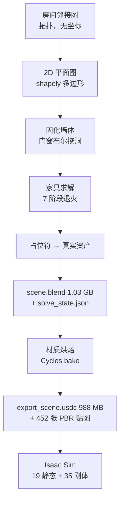
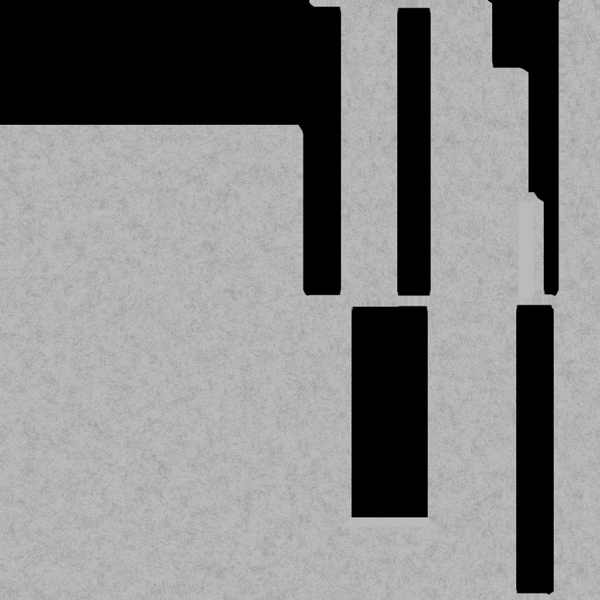

# 房间是怎么生成的

> 从一句命令到一个能跑物理仿真的房间：Infinigen 室内生成 → USD 导出 → Isaac Sim 的完整链路拆解。
>
> 本文所有数字都来自一次真实运行（Windows 11 / RTX 3080 / Infinigen 1.19.1 / Isaac Sim 6.0.1），
> 而非文档转述。代码位置以 `文件:行号` 标注，基于 [princeton-vl/infinigen](https://github.com/princeton-vl/infinigen) main 分支。

## 目录

- [0. 全景](#0-全景)
- [1. 房间生成：三个串联的求解器](#1-房间生成三个串联的求解器)
- [2. 家具摆放：分级贪心 × 模拟退火](#2-家具摆放分级贪心--模拟退火)
- [3. 占位符机制：为什么不直接生成真家具](#3-占位符机制为什么不直接生成真家具)
- [4. 导出烘焙：把程序化材质塌缩成贴图](#4-导出烘焙把程序化材质塌缩成贴图)
- [5. Isaac Sim：让约束图变成物理属性](#5-isaac-sim让约束图变成物理属性)
- [6. Windows 踩坑记录](#6-windows-踩坑记录)
- [7. 复现步骤](#7-复现步骤)

---

## 0. 全景



一次真实运行的耗时与产物：

| 阶段 | 耗时 | 产物 |
|---|---|---|
| 室内生成（coarse） | **33 分 46 秒** | `scene.blend` 1.03 GB、`solve_state.json` 152 KB |
| 导出 + 烘焙 | ~40 分钟 | `export_scene.usdc` 988 MB、452 张贴图 |
| Isaac Sim 仿真 | 启动 ~90 秒 | 19 静态碰撞体 + 35 刚体，跑满 41,400 物理步 |

生成出的场景规模：**7,877,240 顶点 / 13,987,120 三角面 / 251 个对象**，平面图含 **10 个房间**（阳台、2 卫、2 卧、2 储物间、餐厅、厨房、客厅），实际家具求解限制在 1 个房间内。

一个反直觉的事实先说在前面：**这条链路里一共有三个独立的模拟退火求解器**，分别工作在房间拓扑图、2D 多边形、和 3D 物体位姿上。它们共享同一套约束 DSL，但搜索空间完全不同构。

---

## 1. 房间生成：三个串联的求解器

`compose_indoors()` 的完整阶段序列可以从产物 `pipeline_coarse.csv` 直接读出（这是 Infinigen 内建的可观测性出口，记录每个阶段是否执行、结束时内存、对象数）：

| # | 阶段 | 本次 | 对象数 |
|---|---|---|---|
| 0 | terrain | 跳过 | — |
| 1 | sky_lighting | ✓ | — |
| 2 | **solve_rooms** | ✓ | 48 |
| 3 | **solve_large** | ✓ | 51 |
| 6 | populate_intermediate_pholders | ✓ | 53 |
| 7 | **solve_medium** | ✓ | 55 |
| 8 | **solve_small** | ✓ | 90 |
| 9 | **populate_assets** | ✓ | 148 |
| 11-12 | room_doors / room_windows | ✓ | 192 → 210 |
| 17-19 | room_walls / floors / ceilings | ✓ | 250 |
| 22-23 | overhead_cam / hide_other_rooms | ✓ | 251 |

### 1.1 先画图，不画墙

最反直觉的设计：**房间布局的第一步不产生任何坐标**。

`GraphMaker.make_graph`（`room/graph.py:100-199`）从一个 Root 节点开始，最多 40 轮生长：每轮随机挑一个未访问节点，尝试往它上面挂 1~2 个新房间（Kitchen / Bedroom / Bathroom / …），对每个候选调 `evaluate_problem` 打分，再用 softmax `p = exp(-score)/Σexp(-score)` 采样。

关键手法在 `GraphMaker.inject`（`graph.py:57-98`）：它用 `match/case` 对约束程序做**程序变换**——把 `cl.in_range(count, low, high)` 替换成 `cl.rand(count, 'cat', 二项分布权重)`，`ForAll` 替换成 `SumOver`，逻辑与替换成算术加。于是"每套房子应该有 1~3 间卧室"这条硬计数约束，被自动编译成一个负对数似然能量，随机生长过程就等价于按二项分布采样房间数量。

**为什么这样设计**：拓扑约束（"卧室必须能通到卫生间"）和几何约束（"房间面积、长宽比"）被彻底解耦。图很小（本次 10 个房间），可以暴力重采样直到违反数归零；几何留给后面的退火。

房子的外框尺寸也不是硬编码的，而是**测量**出来的（`graph.py:293-345`）：对每种房间类型做一维扫描（把房间设成边长 l 的正方形，l 在 1.5~25m 的对数空间取 20 个采样点），跑约束打分，取得分接近最优的区间做几何平均，得到该类型的"典型面积"；再把图里所有房间的典型面积求和 × 松弛系数，按长宽比拆成 width/height，最后吸附到 0.5m 网格。改 `home.py` 里的面积约束项，整栋房子的尺寸会自动跟着变。

### 1.2 平面图：递归二分 → 概率合并 → 回溯匹配

`SegmentMaker` 把外轮廓矩形变成与图节点一一对应的房间多边形，三步（`room/segment.py`）：

1. **递归二分**（`:158-190`）：切 `int(房间数 × uniform(1.8, 2.0))` 次；每次按 `sqrt(面积)` 加权挑一块，沿长边在 25%~75% 位置切一刀，要求两侧都不小于 1.4m，且切完能吸附到 0.5m 网格。
2. **概率合并**（`:217-242`）：此时块数多于房间数，循环合并——按 `1/(邻居数+1)` 加权挑一块（孤立块优先被吃掉），再在其共享边邻居里按"能带来新邻居"加权挑合并对象，直到块数 == 房间数。
3. **回溯匹配**（`:100-127`）：把图节点分配给几何块。剪枝条件是"已分配的图邻居必须都是该块的几何邻居"且"该块剩余未分配几何邻居数 ≥ 该节点剩余未分配图邻居数"。失败就整体重试。

**为什么绕这么大弯**：这是把"图同构嵌入"降级成"先造矩形块再做匹配"。好处是所有墙都轴对齐——好做布尔运算、好做碰撞检测、好导出。回溯保证图上标记为连通的两个房间，在几何上真的有 ≥1.4m 的共享边可以开门。

### 1.3 平面图退火：在 shapely 多边形上做三种扰动

匹配完成后跑 `200 × 房间数` 次退火（`room/floor_plan.py:162-177`），每次深拷贝状态、随机挑一个非外部房间，然后（`room/solver.py:32-136`）：

- **40%** `extrude_room_out`：沿某条边法向外推 `0.5m × randint(1..5)`，推出的矩形并入本房间，从邻居里减掉
- **40%** `extrude_room_in`：往内缩，让出的面积被邻居吃掉
- **20%** `swap_room`：和某个共享边非零的邻居直接交换多边形

接受准则是 `log(uniform()) < (score - score') × scale and not violated`，其中 `scale = 5 × 进度`——**逆温度随进度线性升高**，等价于降温。任何硬约束违反一律拒绝。

硬约束里最关键的是 `graph_coherent`（`node_impl/rooms.py:157-180`），它统计三类不一致：图上相邻但几何共享边 < 1.4m、房间面积之和 ≠ 外轮廓面积、上层轮廓没被下层包含。**它的作用是防止退火把前一步辛苦匹配好的拓扑撕坏。**

### 1.4 固化：双层挤出 + cutter 布尔挖洞

`BlueprintSolidifier.solidify`（`room/solidifier.py:205-318`）把 2D 多边形变成 Blender 网格：

1. `make_room`：多边形按门宽 segmentize（细分边，保证开门处有顶点）→ 挤出成房间内壳 → 计算哪些面贴外墙 → 再挤一层得到有厚度的墙
2. 每个房间壳复制一份叫 `<name>.meshed`，对它逐个做**布尔差集**减去所有 cutter
3. cutter 本身就是缩放旋转过的立方体：门 cutter、窗 cutter、开口 cutter

**cutter 挖完洞不删除**，因为后续 `populate_doors/populate_windows` 直接把真实门窗资产 parent 到 cutter 上当定位锚点（`decorate.py:388`），cutter 的尺寸就是洞口尺寸，窗户工厂据此生成匹配尺寸的窗。

门窗类型由一张**声明式数据表**决定（`solidifier.py:65-157`）：`combined_rooms` 是 `(房间类型集合 × 是否图上相邻) → 加权随机` 的查表，例如 `{Hallway, LivingRoom, DiningRoom}` 在非图相邻时是 30% 开口 / 30% 落地窗 / 40% 门；而 `{Bedroom}` 单独一组，恒为 `none`——**卧室之间永远是实墙**。门的朝向由从入口房间 BFS 出的跳数决定，朝向"离入口更远"的一侧。

本次运行产出 **28 个 cutter = 18 窗 + 10 门**，一个开口都没有——因为 `singleroom.gin:1` 设了 `enable_open=False`。

---

## 2. 家具摆放：分级贪心 × 模拟退火

### 2.1 约束 DSL：可重载运算符的 AST

约束不是字符串也不是 JSON，而是**一棵 Python 对象树**（`constraint_language/`）。所有原语都是 `@nodedataclass` 装饰的 dataclass，`ScalarExpression` 重载了 `__mul__ / __add__ / __ge__` 等，让 `a + b` 求值成 `ScalarOperatorExpression(operator.add, [a, b])` 而非数值。

一个关键 hack（`types.py:12-16`）：`nodedataclass` 把 `cls.__bool__` 换成抛异常的函数——因为 Python 的 `and`/`or` **不可重载**，强迫用户改写成 `*`（与）和 `+`（或）。

约束分两类打包成 `Problem(constraints, score_terms)`：

- **硬约束**（bool 表达式）→ 违反量 `viol`
- **软代价**（scalar 表达式）→ 损失 `loss`

关系（Relation）是一套**带正负标签的代数**（`relations.py:22-441`），必须实现 `implies` / `satisfies` / `intersects` / `intersection`。例如：

```python
on_floor     = StableAgainst({Bottom,-Top,-Front,-Back}, {SupportSurface,Visible,-Wall,-Ceiling}, margin=0.01)
against_wall = StableAgainst(back_tags, wall_tags, margin=0.07)
ontop        = StableAgainst(bottom, top)
front_to_front = StableAgainst(front, front, margin=0.05, check_z=False)  # 椅子塞进桌子下面
```

标签系统用**三值逻辑**（`core/tags.py:149-267`）：`implies` 用于"部分指定的约束域"，`satisfies` 用于"完全已知的场景对象"。这两套语义的区分贯穿整个推理层。

### 2.2 从硬约束反推数量：constraint_bounds

`propose_addition` 需要知道"还该往场景里加什么、加几个"。`constraint_bounds`（`reasoning/constraint_bounding.py`）递归下降约束图，把 `count().in_range(0, 2)` 这类声明式语句自动翻译成 `Bound(domain, low, high)`，遇到 `a + b`、`a * b` 时用逆运算把界推到非常量那一侧。

**这就是为什么写约束的人从不需要手工列出物体清单。**

### 2.3 七个贪心阶段（按物理依赖排序）

`default_greedy_stages()` 用 Domain 代数把家具问题切成互不重叠的阶段，执行顺序在 `generate_indoors.py:195-307`：

```
solve_large  (300 步) → on_floor_and_wall → on_floor_freestanding
                     ↓
       populate_intermediate_pholders   ← 大件先变成真实网格
                     ↓
solve_medium (200 步) → on_wall → on_ceiling → side_obj
                     ↓
solve_small  (50 步)  → obj_ontop_obj (addition 权重 ×3)
                      → obj_on_support (仅允许 addition move)
```

**顺序由物理依赖决定**：小物件要放在柜子顶面上，柜子必须先存在且已经是真实网格——占位用的 bbox 盒子没有隔板。`obj_on_support` 只允许 Addition，是因为柜内物体的位姿完全由 relation 决定，平移旋转没有意义。

`checks.validate_stages` 用两两 `intersects` 强制阶段互斥，`check_problem_greedy_coverage` 强制每个 Bound 恰好被 1 个阶段覆盖——**保证分解不重不漏**。

### 2.4 退火主循环

每个阶段对每个变量赋值（哪个房间 × 哪个父物体）跑一次独立退火。`restrict_solving.solve_max_rooms=1` 就作用在这里，限制枚举出的赋值数量。

温度调度（`annealing.py:93-111`）：`initial_temp=3`、`final_temp=0.001`、`finetune_pct=0.15`，几何降温，最后 15% 迭代停在最低温做精修。

**7 种 move，权重随进度线性衰减**（`solve.py:89-136`）：

| move | 权重调度 | 做什么 |
|---|---|---|
| addition | 6 → 0.1（前 90%） | 按 Bound 挑工厂类，搜索 relation 赋值 |
| deletion | 2 → 0（前 50%） | 删除超额对象 |
| plane_change | 2 → 0.1 | 换一面墙 / 换一层隔板 |
| resample_asset | 1 → 0.1（前 70%） | 同工厂重新采样实例 |
| reinit_pose | 1 → 0.5 | 在支撑面上重新随机落点 |
| translate | 常数 1 | 步长 `N(0, 8×temp)`，**投影到自由度矩阵** |
| rotate | 常数 0.5 | `N(0, π×temp)` 后量化到 45° 整数倍 |

本次实跑的 move 分布（1600 步）：addition 699、translate 257、plane_change 203、reinit_pose 171、rotate 135、resample 74、deletion 61。

### 2.5 接受准则：violation 优先的字典序

这是整个求解器最重要的设计（`annealing.py:227-250`）：

```python
viol_diff = prop.viol_count() - curr.viol_count()
if viol_diff < 0:  return accept=True    # 无条件接受
if viol_diff > 0:  return accept=False   # 无条件拒绝，完全不看 loss
# 只有 viol 持平时才走标准 Metropolis-Hastings
accept = log(uniform()) < -(prop.loss() - curr.loss()) / temp
```

即 `(viol, loss)` 构成**字典序目标**，退火只在可行域的等值面上做随机游走。硬约束（"每个房间必须有 1~4 盏吸顶灯"）永远不会被软代价（"家具占地率接近 0.75"）换掉。

顺带解一行真实日志：

```
annealing it=27/50 dt=3.308 n=44 loss=2.337e+01 viol=0.0 temp=1.85e-02
          diff=-0.37 prob=1.00 accept=False Addition(DeskLampFactory, 1 relations)
```

- `it=27/50` — 50 步说明这是 solve_small 阶段
- `n=44` — 当前 State 里的对象总数
- `temp=1.85e-02` — 可精确验证：`steps = 50×0.85 = 42.5`，`cooling_rate = (0.001/3)^(1/42.5) = 0.82834`，`3 × 0.82834^27 = 0.01855` ✓
- `diff=-0.37` — 这次提议让 loss **下降**了
- `prob=1.00` — 接受概率 100%
- **`accept=False`** — 最有信息量的一行：loss 下降、概率 100%，标准 MH 必然接受，唯一可能就是 `viol_diff > 0` 触发了无条件拒绝分支。这盏台灯降低了软代价，却打破了某条硬约束。

### 2.6 几何落位：最小二乘解位姿 + 自由度矩阵

Addition 之后立刻调 `dof.try_apply_relation_constraints`（`geometry/dof.py`），最多重试 10 次：

1. 把每条 relation 解析成 `(子平面, 父平面, margin, 法向翻转)`
2. **旋转**：用第一条关系的法向叉积算旋转轴角；后续关系只允许绕第一个平面法向再转一次
3. **平移**：为每条关系建方程 `n·x = n·(p_b + margin·n - p_a)`，堆成 `Ax = c` 用 `np.linalg.lstsq` 求解，残差 < 1e-3 才有效，返回剩余自由度 `dof = 列数 - rank`
4. 按 dof 分支：`dof=0` 直接平移；`dof=1`（靠墙又贴地）在包含面上随机采点后依次贴合；`dof=2`（只有一个支撑面）先把 z 旋转设成 90° 整数倍再随机采点（按面积加权选三角面 + 重心坐标）
5. 成功后写回 `dof_matrix_translation`（每个父平面贡献一个 `I - nnᵀ` 投影矩阵连乘）和 `dof_rotation_axis`

**这两个字段正是后续 translate/rotate move 的候选过滤条件和步长投影矩阵**——平移向量先投影再应用，天然不会破坏已满足的关系，因此不需要每次移动后重解。

在 `solve_state.json` 里能直接看到它们：37 个对象的平移自由度是 `(1,1,0)` + 可绕 Z 旋转（能在水平面上滑动和转向），3 个是 `(0,1,0)` 且不可旋转（只能沿一条轴滑）。

### 2.7 每步之后的合法性校验

`check_post_move_validity`（`geometry/validity.py:71-141`）：

- **关系谓词**：`StableAgainst` 检查两平面法向平行、投影包含关系（不能悬空）、每个顶点到父平面距离 ≈ margin
- **碰撞**：trimesh `CollisionManager`（底层 FCL）要求最大穿透深度 ≤ 0.1mm

**这个过滤非常激进**：本次 1600 步里，1212 步最终没有任何提议被求值（913 步生成器一个候选都没产出，299 步产出了候选但 5 次尝试全部落位失败），只有 388 步真正进入 MH 判定，其中 113 步被接受（≈7%）。

把校验放在 `move.apply()` 里而不是放进 loss，是为了让失败的提议立刻被丢弃，不浪费一次完整的约束图求值。

### 2.8 惰性求值与缓存失效

一次完整的约束图求值要跑几十次 FCL 距离查询，因此每步退火前后调 `evict_memo_for_move`（`evaluator/eval_memo.py`）做**定向失效**：自底向上遍历约束图，只有当某子树确实"看得见"这个对象时才删缓存；BVH 缓存也只清 key 里含该对象名的条目。

例外是 Deletion——对象已经不在 state 里，无法定向失效，只能**清空整个缓存**（代码里明确标注为 hack）。这也是 deletion 权重在前 50% 就衰减到 0 的隐性原因之一。

### 2.9 本次求解器行为

`optim_records.csv` 共 1600 行 = **12 次独立退火**：1 段 300 步（solve_large）、5 段 200 步（solve_medium）、6 段 50 步（solve_small）。各段耗时合计 ≈ 23.2 分钟，**占整个 33m46s 的三分之二**。

其中 solve_small 的 4 段（162 + 220 + 287 + 321 = 990 秒）是最大开销——此时场景里已有真实网格资产，FCL 碰撞检测成本最高。

一个有意思的观察：`propose_rotate` 被调用 135 次，**全部产出 0 个候选**——没有对象同时满足"有 `dof_rotation_axis` 且该轴与 +Z 夹角 dot > 0.95 且无 NoRotation 标签"。

---

## 3. 占位符机制：为什么不直接生成真家具

求解阶段放进场景的**全是低模占位符**。`sample_rand_placeholder`（`moves/addition.py:39-72`）按工厂的元数据标签四选一：

| 分支 | 做法 | 适用 |
|---|---|---|
| `RealPlaceholder` | 调工厂自定义的 `create_placeholder` | 柜子、书堆等能廉价给出正确外形的 |
| `AssetAsPlaceholder` | 直接 spawn 真资产 | 本次为空 |
| `PlaceholderBBox` | spawn 占位符后取 AABB 造盒子 | — |
| 都没有 | **spawn 完整高模 → 量 bbox → 造盒子 → 删掉高模** | 最贵的兜底 |

举个具体例子：`NatureShelfTrinketsFactory` 的 `create_placeholder` 只是一个边长 `uniform(0.1, 0.15)` 的立方体，而 `create_asset` 会 spawn 香蕉/贝壳/食肉动物等自然资产再缩放进那个盒子里。

**为什么**：求解器每一步都要做碰撞检测和平面对齐。如果每次 addition 都生成真实资产，一次提议就是几十万面 + 完整材质节点树。占位符让求解阶段只处理十几到几百面的代理。

`populate_assets` 阶段（`populate.py`）才把占位符逐个换成真实资产——本次运行填充了 **38 个**，对象数从 90 跳到 148。

标注也在这一步落定：每个面上写一个 int 属性 `MaskTag`，配一张全局 tag 名字典（本次 67 条）。这就是 Infinigen 能给出像素级精确语义分割的原理——**标注是几何的直接投影，不是后处理**。

---

## 4. 导出烘焙：把程序化材质塌缩成贴图

Infinigen 的材质活在 Blender shader 节点里，任何外部引擎都读不了。`tools/export.py` 的工作就是把它们烘成 PBR 贴图。

流程（`export.py:1135-1290`）：

1. `remove_obj_parents`（清父子关系但保持世界坐标）
2. `delete_objects` 删掉 placeholders 集合
3. `triangulate_meshes` 全场景四边形转三角形
4. `rename_all_meshes` + `clean_names`——把名字里的空格和 `.` 换成 `_`，**因为 UV 名带 `.` 会导致 USD 导出错误**
5. `apply_all_modifiers`，设 Cycles / GPU / samples=1
6. `bake_scene` → 逐 mesh `bake_object`：
   - `uv_unwrap` 新建 ExportUV 并 smart_project
   - **深拷贝材质**（多个 mesh 共享材质时烘焙会互相覆盖）
   - `DIFFUSE / ROUGHNESS / NORMAL` 走标准 bake
   - `METAL / TRANSMISSION` 走 `bake_special_emit`——把对应 BSDF 输入临时接到 Emission 上，用 EMIT 通道烘出来
   - `apply_baked_tex` 把贴图接回一个只有贴图的 Principled BSDF
7. `bpy.ops.wm.usd_export(export_textures=True, root_prim_path='/World')`

`--omniverse` 额外做三件事：点光源瓦数换算到 Omniverse 单位、`origin_set(ORIGIN_GEOMETRY, MEDIAN)` 设质心、删除 0 面网格。

**452 张贴图** = 各 mesh × 最多 5 个通道，只有真正有对应 shader 输入的才会写盘。下面是本次烘出的墙面 Albedo（`balcony_0_0_wall_DIFFUSE.png`）——注意墙上的污渍、色差和边角磨损全部是程序化生成的，不是任何贴图库里的素材：




`root_prim_path='/World'` 这个参数直接决定了下游 Isaac Sim 里 `/World/Support/...` 的 prim 路径。

> **为什么整场景只支持 USDC**：Infinigen 用实例化（instancing）表示密集散布的物体。除了 `.blend` 和 `.usdc`，没有格式支持保存实例化几何——其他格式导出时会把实例"实体化"，几百万实例复制粘贴后内存直接爆掉。

---

## 5. Isaac Sim：让约束图变成物理属性

### 5.1 solve_state.json 是唯一的语义桥梁

USD 里只有网格和变换，**没有"这个柜子是靠墙的"这类信息**。而求解器早就知道答案。

`State.to_json`（`state_def.py:116-160`）把求解结果序列化，`export.main` 有一段专门把它原样复制到导出目录（`export.py:1269-1270`），就是为了让 `isaac_sim.py` 能拿到。

本次产物的结构：**78 个对象**，每个含 `obj`（Blender 对象名）、`tags`、`relations`、`dof_matrix_translation`、`dof_rotation_axis`。关系共 170 条：

| 关系类型 | 条数 | 含义 |
|---|---|---|
| `RoomNeighbour` | 90 | 房间邻接（带 connector_types: Wall / Door） |
| `StableAgainst` | 43 | 我的某个面稳定贴合你的某个面 |
| `CutFrom` | 37 | 门窗对墙做布尔差 |

`CutFrom` 有个优雅的细节：**一扇门同时 CutFrom 它连接的两个房间**——`door` 既 CutFrom `balcony_0/0` 又 CutFrom `living-room_0/0`。

一个典型对象长这样：

```json
{
  "obj": "NatureShelfTrinketsFactory(2574611).spawn_asset(5172547)",
  "dof_matrix_translation": [[1,0,0],[0,1,0],[0,0,0]],
  "dof_rotation_axis": [0, 0, 1],
  "relations": [{
    "relation": {
      "relation_type": "StableAgainst",
      "child_tags": ["Subpart(bottom)", "-Subpart(top)", "-Subpart(back)", "-Subpart(front)"],
      "parent_tags": ["Subpart(support)"],
      "margin": 0, "check_z": true
    },
    "target_name": "780816_KitchenCabinetFactory"
  }]
}
```

翻译成人话：**"我的底面稳定地放在那个厨房柜子的支撑面上；我可以在水平面上滑动、绕 Z 轴转，但不能上下浮动。"**

### 5.2 分类规则

`isaac_sim.py` 把这些关系翻译成 PhysX 属性：

```
名字含 terrain          → 跳过
在 solve_state 里查不到  → 静态碰撞体
StableAgainst 且 parent_tags 含 Subpart(wall)
  或 parent_tags 含 Subpart(ceiling)  → 静态碰撞体   # 挂画、吸顶灯不该掉下来
其余                                  → 刚体（凸分解）
```

用凸分解而非三角网碰撞，是 PhysX 对动态刚体的硬性要求。

### 5.3 实测验证

我独立复现了这套分类逻辑并与仿真日志比对，**结果精确吻合**：

| 类别 | 数量 | 内容 |
|---|---|---|
| 静态碰撞体 | **19** | 门、窗、落地盆栽、橱柜、吸顶灯 + 房间外壳（floor/wall/ceiling） |
| 刚体 | **35** | 书架摆件 ×27、书堆 ×3、书柱 ×3、小盆栽 ×2 |

**一个值得记录的意外**：54 个 prim 里有 14 个在 `solve_state.json` 里根本匹配不上，全部落进"默认静态"分支——正好是房间的墙/地/顶。

原因是名字净化规则不一致：`obj_to_target` 只替换了 `( ) .` 三个字符，**没有替换 `/`**，而房间的 objkey 形如 `balcony_0/0`，USD 里 `/` 早已被净化成 `_`。两边永远对不上。

所以"房间外壳是静态碰撞体"这个正确结果，是靠一个名字不匹配的巧合达成的。真要修的话，还得同时处理另一个问题：`RoomNeighbour` 和 `CutFrom` 关系根本没有 `parent_tags` 键（170 条里有 127 条如此），一旦名字匹配上了，`"Subpart(ceiling)" in None` 会直接抛 `TypeError`。

同一段代码还有个运算符优先级问题：条件写成 `A and B or C`，Python 里等价于 `(A and B) or C`——任何 `parent_tags` 含 `Subpart(ceiling)` 的关系都会让对象变静态，**不要求 relation_type 是 StableAgainst**，看注释意图应该是 `A and (B or C)`。

---

## 6. Windows 踩坑记录

在 Windows 11 + Isaac Sim 6.0.1 上跑通这条链路，一共修了 5 个上游问题：

| # | 位置 | 症状 | 原因与修法 |
|---|---|---|---|
| 1 | `core/tagging.py:124` | `AssertionError: int32` | numpy 默认整型在 Windows 是 int32、Linux 是 int64。读回 tag 属性后加 `.astype(np.int64)` |
| 2 | `tools/export.py` `main()` | 烘焙贴图写进 **C 盘根目录** | 未保存的 blend 里，Blender 把相对路径解析到盘符根而非 CWD。在 `main()` 开头对 input/output folder 加 `.resolve()` |
| 3 | `tools/isaac_sim.py:8-26` | `ModuleNotFoundError` | 所有 `omni.*` import 在 `SimulationApp()` 之前。必须把 SimulationApp 创建提到最前，并用 `# isort: skip_file` 防止格式化工具重排 |
| 4 | 同上 | `omni.isaac.*` 全部不存在 | **Isaac Sim 5.0 起整体移除了 `omni.isaac.*` 命名空间**。需迁移到 `isaacsim.*`：`isaacsim.core.api`、`isaacsim.core.prims.SingleXFormPrim`（原 `XFormPrim`）、`isaacsim.storage.native`、`isaacsim.robot.wheeled_robots` |
| 5 | `isaac_sim.py` `_get_camera_loc` / `_add_robot` | 崩在放机器人那步 | 硬编码找 `CameraRigs_0_0`，实际导出是 `camera_0_0`；Jetbot 路径在 6.x 变成 `/Isaac/Robots/**NVIDIA**/Jetbot/jetbot.usd`。两处都改成候选列表 + 多级回退 |

另外两个环境层面的注意事项：

- **别用 `uv sync --extra infinigen1`**：`scikit-image==0.19.3` 在 Windows 上没有 wheel，会触发源码编译并失败。改用 `uv pip install` 手动装较新版本，再用 `uv run --no-sync` 运行。
- **`app.close()` 在 Windows 会弹断言框**（`Destroying busy TaskGroup!`），阻塞进程退出。脚本收尾用 `os._exit(0)` 规避。
- 一个 Windows 特有的序列化副作用：`solve_state.json` 里的 `parent_plane_idx` 全是 `"<not-serialized>"`，因为 `preprocess_field` 只匹配 `np.int64`，而 `np.arange` 在 Windows 上给的是 int32。

---

## 7. 复现步骤

```bash
# 1) 生成室内场景（约 34 分钟，主要吃 CPU）
uv run python -m infinigen_examples.generate_indoors \
  --seed 0 --task coarse \
  --output_folder <绝对路径>/outputs/indoors/coarse \
  -g overhead singleroom \
  -p compose_indoors.terrain_enabled=False restrict_solving.solve_max_rooms=1
```

```bash
# 2) 导出 + 材质烘焙（约 40 分钟，吃 GPU 和内存；Windows 上务必用绝对路径）
uv run python -m infinigen.tools.export \
  --input_folder <绝对路径>/outputs/indoors/coarse \
  --output_folder <绝对路径>/outputs/isaac_export \
  -f usdc -r 1024 --omniverse
```

```bash
# 3) 在 Isaac Sim 里跑物理仿真
C:\isaacsim\python.bat <仓库>/src/infinigen/tools/isaac_sim.py \
  --scene-path <绝对路径>/outputs/isaac_export/export_scene.blend/export_scene.usdc \
  --json-path <绝对路径>/outputs/isaac_export/solve_state.json
```

---

## 尾声：这套设计给人的启发

拆完整条链路，最值得记住的是三个设计选择：

1. **先拓扑后几何**。房间邻接图不含任何坐标，让图论约束和几何约束彻底解耦，各自用最适合的搜索方法。
2. **字典序目标**。硬约束违反量优先于软代价，让退火一旦进入可行域就不会因为"审美分数"而退出。这比把硬约束加权塞进单一 loss 函数稳健得多。
3. **中间表示要携带语义**。`solve_state.json` 是这条链路真正的枢纽——正因为求解器把"谁贴着墙、谁摞在谁上面"显式记录下来，下游才能零成本地把它翻译成物理属性。如果只导出网格，这些信息就永久丢失了，任何几何启发式都无法区分"放在桌上的杯子"和"嵌在墙里的窗"。

---

*本文档由 [infinigen-webui](https://github.com/Seanwilliam2077/infinigen-webui) 项目整理。Infinigen 由 Princeton Vision & Learning Lab 开发，BSD-3-Clause 协议。*
